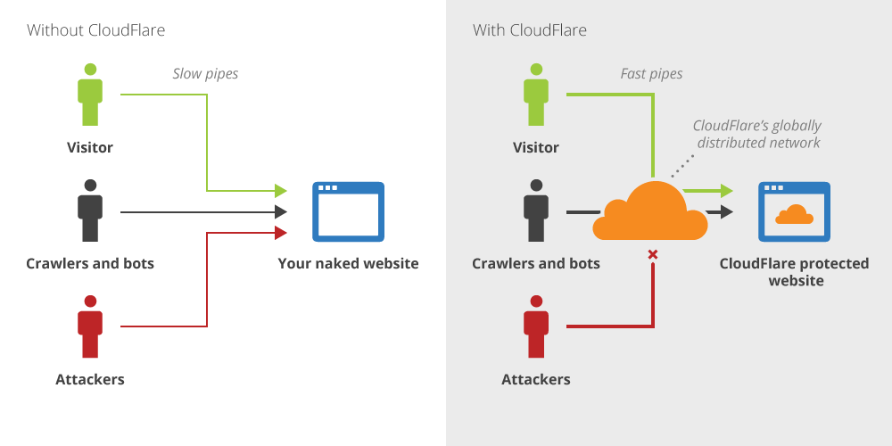

# How to use the website

click [here](https://www.markdownguide.org/) to see demo


Words **Bytes** Lists Rich Text HTML Copy Lorem ipsum dolor sit amet consectetur adipiscing, elit tellus euismod feugiat orci a scelerisque, vel risus quis proin faucibus. Integer tristique augue ut dictum magnis parturient metus elementum, eleifend venenatis torquent eget sollicitudin ornare montes nam, senectus leo blandit id cursus porttitor himenaeos. Dignissim purus scelerisque vitae hac metus ad non erat, massa aliquam dictum cursus bibendum nisl porta malesuada habitasse, quisque penatibus vulputate proin convallis mus maecenas.

Aliquam montes facilisis hendrerit gravida morbi interdum odio natoque tempus molestie ornare, scelerisque viverra purus habitant feugiat nisl et volutpat nulla laoreet. Ultricies feugiat nunc sociosqu quam purus malesuada morbi suscipit inceptos ante gravida dui sodales aenean, porta vehicula quis pharetra augue hac turpis duis tortor id ultrices et. Hac porta auctor integer fermentum luctus nunc urna donec conubia, dis velit erat commodo inceptos mi vestibulum himenaeos augue egestas, sociis arcu aptent ante aenean ultrices non ullamcorper..



> Dorothy followed her through many of the beautiful rooms in her castle Dorothy followed her through many of the beautiful rooms in her castle

# Heading level 1

## Heading level 2

### Heading level 3

#### Heading level 4

##### Heading level 5

###### Heading level 6

Heading level 1
===============

Heading level 2
----------------

# Here's a Heading

```HTML
<!DOCTYPE html>
<html lang="en">
<head>
    <meta charset="UTF-8">
    <meta name="viewport" content="width=device-width, initial-scale=1.0">
    <title>Document</title>
</head>
<body>
    <div>Commit_2</div>
</body>
</html>
```

---

| Syntax      | Description |
| ----------- | ----------- |
| Header      | Title       |
| Paragraph   | Text        |